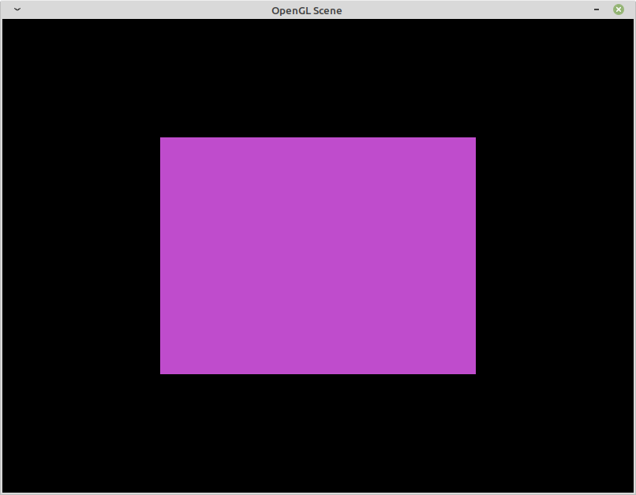

# OpenGLScene
By Noé Boonstra, Kilian Cannet and Pierre Cartigny  

OpenGL student project  

Screenshot of the last result :  
  
  
Using :  
* OpenGL 4.0  
* GLSL 140  
* SDL2  
* SDL2_image  
* glew  
* glm  
  
Platforms :  
* Ubuntu 18.04 - GNU  
* Windows 10 - VS 2019  
* Windows 7 - VS 2015  
  
Features :  
* OpenGL calls abstracted into classes  
* OpenGL Errors catching  
* Recursive Scene Objects  
* Controllable Camera  
**f** to switch controllable/traveling camera  
**Right click** to orient  
**ZQSD** to move around  
**Space** and **<** (less) to move up and down  
* OBJ File loader  

Installation :  
* Execute `cmake` with your target platform build
* For windows set the target directory as build
* For linux you can let the default target. WARNING some linux dependencies in `CMakeLists.txt` have been changed from /usr to /usr/lib/x86_64-linux-gnu to work on my computer. May need to be changed. 
* Compile with make for the ressources to be generated at the right place.
