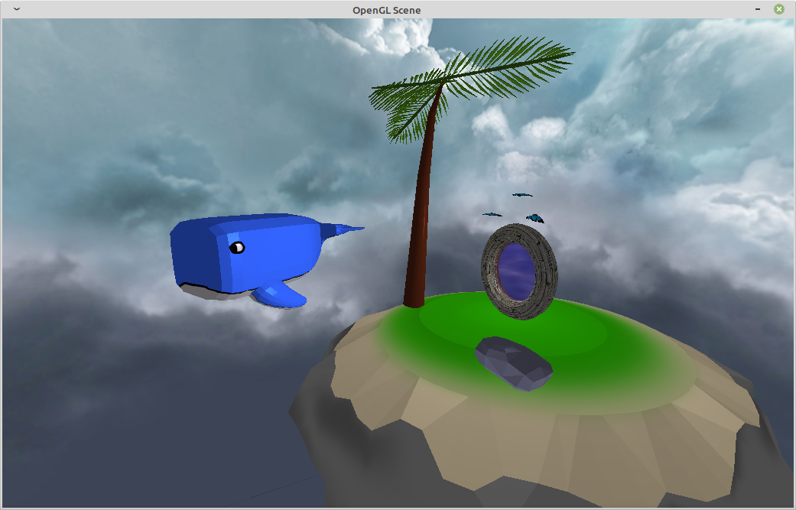

# OpenGLScene
By Noé Boonstra, Kilian Cannet and Pierre Cartigny  

OpenGL student project  

Screenshot of the last result :  
  
  
Using :  
* OpenGL 4.0  
* GLSL 140  
* SDL2  
* SDL2_image  
* glew  
* glm  
  
Platforms :  
* Ubuntu 18.04 - GNU  
* Windows 10 - VS 2019  
* Windows 7 - VS 2015  
  
Features :  
* OpenGL calls abstracted into classes  
* OpenGL Errors catching  
* Recursive Scene Objects  
* Controllable Camera  
**f** to switch controllable/traveling camera  
**t** to switch wireframe mode  
**Right click** to orient  
**ZQSD** to move around  
**Space** and **<** (less) to move up and down  
* OBJ File loader  
* Fong light system
* Fog
* Dynamic cross-dimensional real-time full-featured futuristic portal

Installation :  
* Execute `cmake` with your target platform build
* For windows set the target directory as build. Warning due to some strange git or windows stuff, the encoding changes when pulling and need to be set to UNIX (LF) mode.
* For linux you can let the default target. WARNING some linux dependencies in `CMakeLists.txt` have been changed from /usr to /usr/lib/x86_64-linux-gnu to work on my computer. May need to be changed. 
* Compile with `make` command for the ressources to be generated at the right place.
